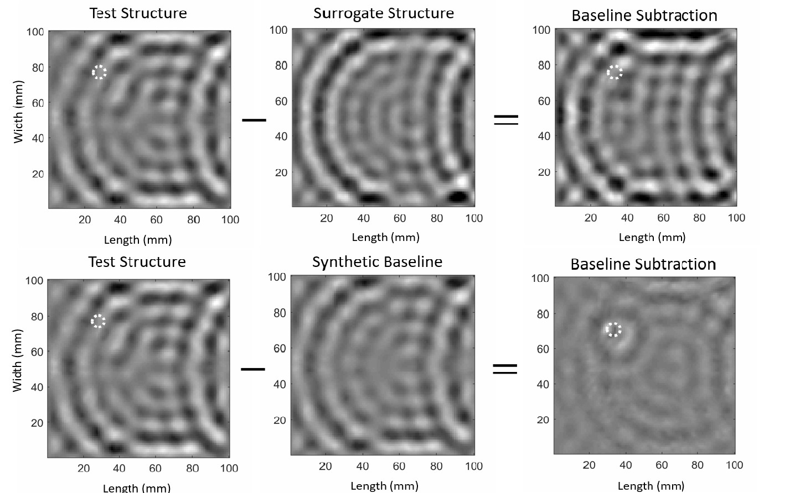
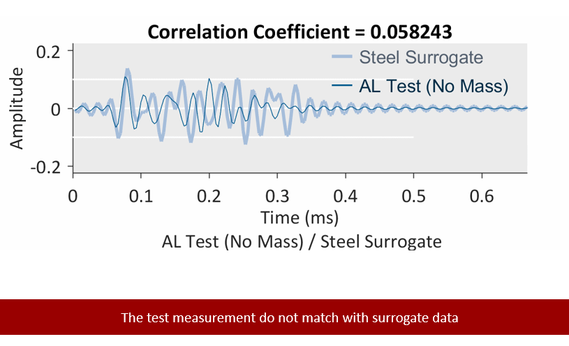
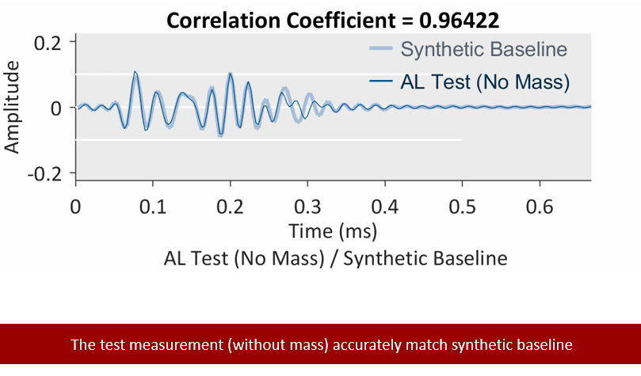
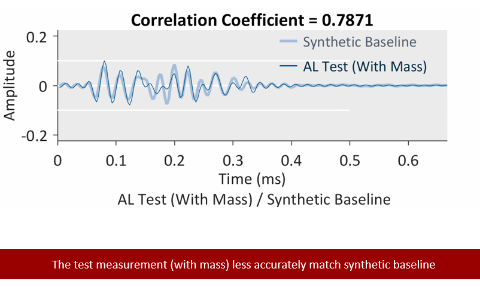

# transfer-learning-waves
This is the implementation of my paper published in special edition Compressed Sensing in JASA https://doi.org/10.1121/1.5042240

For data and questions, please email me: kssupreet@gmail.com
